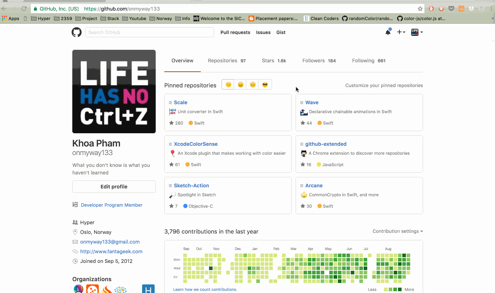

# github-extended
A Chrome extension to discover more repositories


# Features

- Template using [generator-chrome-extension](https://github.com/yeoman/generator-chrome-extension)
- Available https://chrome.google.com/webstore/detail/github-extended/doidfnmbfadacpcjkekkgofkmnkljnhi/related

```js
gulp build
```



## Author

Khoa Pham, onmyway133@gmail.com

## Contributing

We would love you to contribute to **GithubSwift**, check the [CONTRIBUTING](https://github.com/onmyway133/GithubSwift/blob/master/CONTRIBUTING.md) file for more info.

## License

**GithubSwift** is available under the MIT license. See the [LICENSE](https://github.com/onmyway133/GithubSwift/blob/master/LICENSE.md) file for more info.
